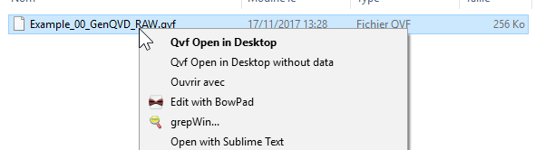

# RightQlikSense

Just a quick hack to add Windows context menu to open QVF files in default web navigator (and in Qlik Sense Desktop) even if the application is not in the directory `C:\Users\[Username]\Documents\Qlik\Sense\Apps`


> Qlik Sense Desktop need to be started before action work





Double click on qvf file work and open application in navigator


Only tested on Windows 10 


## Installation


- Download files here https://github.com/Nexys-Consulting/RightQlikSense/archive/master.zip
- Unzip `master.zip`
- Double click on `Install-RightQlikSense.reg` to import context menu script in Windows registry


## Remove

If you want remove context menu Double click on `Remove-RightQlikSense.reg` to delete context menu for .qvf files.


## PowerShell code

For curious here the PowerShell code used in menu:

**Open**:

```powershell
Add-Type -AssemblyName System.Web;
$EncodedUrl = [System.Web.HttpUtility]::UrlEncode("%V");
start "http://localhost:4848/sense/app/$EncodedUrl";
```

**Open without data:**

```powershell
Add-Type -AssemblyName System.Web;
$EncodedUrl = [System.Web.HttpUtility]::UrlEncode("%V");
start "http://localhost:4848/sense/app/$EncodedUrl/noData/true";
```

